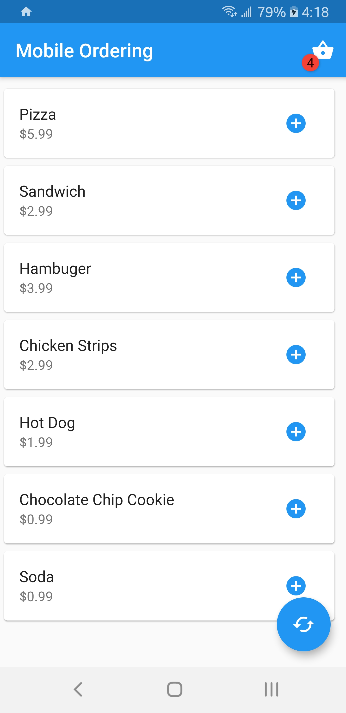
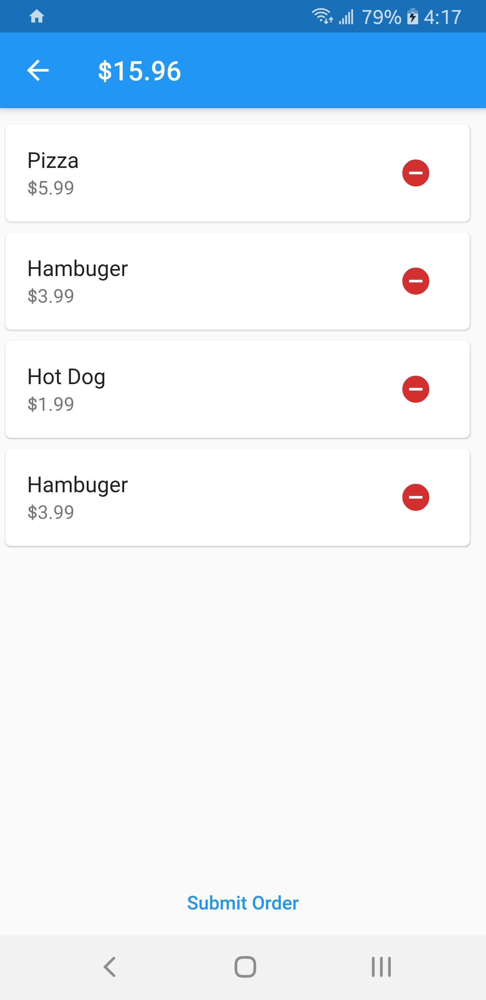

# Mobile Order
A simple mobile ordering framework, complete with example mobile app and backend server. 

## Server
All of the server code resides in bin/server. To run the server, execute:
`dart bin/server/server.dart`

## Mobile App
The mobile app is written in Flutter. Please ensure that you have all of the dependencies installed (Dart, Flutter, Android SDK),
and then execute:
`flutter run`
to run the mobile app on your device. For testing purposes, press the connect button and enter
the IP address of the server you wish to connect to. 

## Architecture
### Server
The server architecture follows a Microkernal type pattern. Functionally independent plugins, referred to in the code as `services` are attached to a basic, minimally functional server, the `ServiceProvider`.

`ServiceProvider` -> Binds together plugins such as `MenuService`, `CartService`, `PaymentService`

The server connects to the client through [gRPC](https://grpc.io/). I initially explored both REST and JSON-RPC as potential backend solutions but after significant research and testing settled on gRPC as the best possible backend system.

### Client
Since the backend and frontend are connected with gRPC, the client code can be written in any language that has gRPC bindings. An example mobile app is provided that is written using Flutter and Dart. 

Example code for a simple command line client is also provided. After running the server, execute the command:
`dart bin/client.dart`
The command line client will connect to the server, pull the menu information and display it.

Client architecture follows a similar plugin type pattern like the server. The `ConnectionManager` class connects to the server, which allows direct access to specific server plugins through the classes `MenuClient`, `CartClient`, `PaymentClient`, etc.

Client/server code is independent of the UI code. The Flutter app operates as a system of pages, with `OrderPage` being the main page and `CartPage` displaying the cart.

#### Mobile App Screenshots
 
